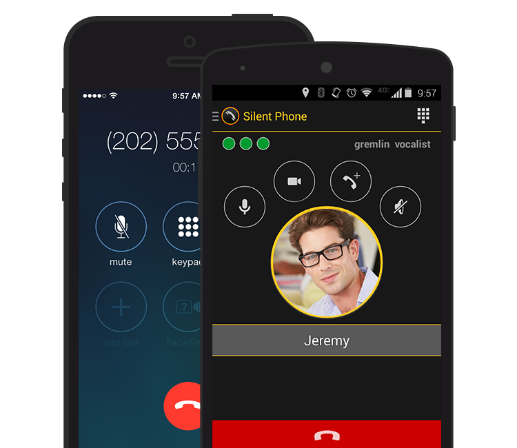
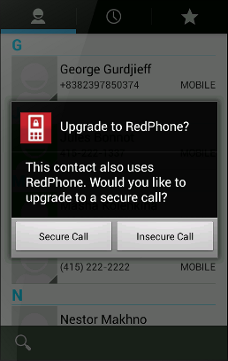
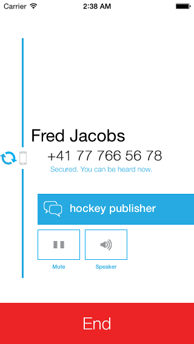

#Encrypt Everything: Voice Calls

The Encrypt Everything series highlights simple apps, programs, tools, and techniques you can use to encrypt your life. Encrypting voice calls is an important step to reclaim your mobile privacy. The process is very simple thanks to some wonderful new apps.

## The Problem

It's no secret that the US surveillance apparatus has and utilizes the ability to record our phone calls. In fact, telcos have been legally required to build in wiretapping capabilities since the passing of the 1994 Communications Assistance for Law Enforcement Act. Leaks of NSA programs like [MYSTIC](https://firstlook.org/theintercept/article/2014/05/19/data-pirates-caribbean-nsa-recording-every-cell-phone-call-bahamas/) have revealed the potential scope the organization has and in fact, former high ranking NSA official turned whistle-blower [William Binney](https://en.wikipedia.org/wiki/William_Binney_%28U.S._intelligence_official%29) claims that we illegally store [80% of all audio calls](http://www.theguardian.com/commentisfree/2014/jul/11/the-ultimate-goal-of-the-nsa-is-total-population-control).

Even more worrying is that other agencies are using this illegal gathered information and explaining their revelations via [parallel construction](). For example, the [DEA has an entire department](http://www.reuters.com/article/2013/08/05/us-dea-sod-idUSBRE97409R20130805) dedicated to using illegally gathered information, making up legal collection methods (parallel construction), and using it to prosecute.

##The Solution

When it comes to voice calls, there are a couple of excellent options for both Android and iOS (sorry Windows phone users).

All of these apps make use of data connection instead of your voice minutes to make calls which is important to keep in mind if you have a limited data plan. Calling over wifi will give you the best quality while preventing you from using sometimes expensive cellular data.

Calling over data has the additional advantage of hiding your [metadata](https://en.wikipedia.org/wiki/Metadata) all that pesky information that the [NSA loves](http://www.computerworld.com/article/2473898/data-privacy/nsa-collected-1-trillion-metadata-records--harvested-1-billion-mobile-calls-daily.html) and includes the who, when, where, how often, and how longs of your call history.

###The Paid Option

 [Silent Circle](https://silentcircle.com/) is famous for their mobile security apps. Founded by former Navy SEAL Mike Janke and the inventor of PGP and ZRTP Phil Zimmerman, the company has a legacy in security. Silent Circle offers encrypted calling plans and text messages (which we'll address in a future post) from your mobile device and desktop starting at [$9.99](https://silentcircle.com/pricing) a month.

The level of security with Silent Circle is top notch and they open source their software ([here](https://github.com/SilentCircle) is their repo). [Open sourcing](https://en.wikipedia.org/wiki/Open-source_software_security) work means anyone can examine the code and build the apps themselves ensuring that there are no vulnerabilities, that if there are vulnerabilities they are found and fixed quickly, that there are no hidden [backdoors](https://en.wikipedia.org/wiki/Backdoor_%28computing%29), and by compiling yourself that the app you have matches the code you see. This is much preferred to closed- source software where you have to place complete trust in the manufacturer.

###The Free Option

 [Open WhisperSystems](https://whispersystems.org/) is an open source project funded by various security and privacy conscious foundations founded by security researcher Moxie Marlinspike and roboticist Stuart Anderson. They produce a number of free and open source apps for security and privacy concious Android and iOS users. Open WhisperSystems has made a huge effort to make encryption seamless and simple, something they have garnered praise for from individuals like [Edward Snowden](http://securitywatch.pcmag.com/security/321511-snowden-to-sxsw-here-s-how-to-keep-the-nsa-out-of-your-stuff).

Their voice encryption products are currently split into a iOS and Android versions, though the plan is to eventually merge their products. The two apps _do_ work with each other so Android users can make encrypted calls to iOS users.

####Android

 For Android users there is [RedPhone](https://play.google.com/store/apps/details?id=org.thoughtcrime.redphone&hl=en). All you need to do is install and RedPhone takes care of the rest. You can even use your regular dialer and if the person you call is also a RedPhone user, you will be prompted to upgrade the call to an encrypted connection. You can check out the source code [here](https://github.com/whispersystems/redphone).

RedPhone has received only minor updates recently as work is underway to merge RedPhone and secure text messaging app TextSecure into the unified Signal app for Android.

####iOS

 For Apple users Open WhisperSystems [just released](https://whispersystems.org/blog/signal/) their iOS port [Signal](https://itunes.apple.com/app/id874139669). The implementation is not quite as elegant as the Android version (though it's much prettier) and requires users to dial from within the Signal app. Calls to a Signal users appear as a push notification which admittedly can be easy to miss. You can check out the source code [here](https://github.com/WhisperSystems/Signal-iOS).

[Text messaging](https://github.com/WhisperSystems/TextSecure-iOS) is coming to iOS Signal later this year.

Work is also underway for to bring a [browser version](https://github.com/whispersystems/TextSecure-Browser) to desktops.

###Which to Choose

The two systems are very similar. Both Silent Circle and Open WhisperSystems utilize the same encryption scheme - [ZRTP](https://en.wikipedia.org/wiki/ZRTP) (designed in part by Silent Circle founder Phil Zimmerman). Both are open source. Both systems require the other party to have the app installed (Silent Circle to Silent Circle or RedPhone/Signal to RedPhone/Signal).

Odds are you don't need to pay for Silent Circle unless you have needs for an Enterprise class security app and the customer support that comes with that.

##The Catch

Remember when we talked about [open source security software](https://en.wikipedia.org/wiki/Open-source_software_securit) above? Unfortunately, depending on your mobile OS, there are significant portions of your phone that are closed source and thus impossible to audit. 

Android users have it slightly better in that the majority of their OS is open source (especially if they're using a custom ROM), but large parts of iOS are hidden and could contain backdoors for apple and/or law enforcement or vulnerabilities that open your device up to snooping.

Even worse, _all_ phones regardless of their operating system have a lower level [baseband processor](https://en.wikipedia.org/wiki/Baseband_processor) that runs all the radios and other functions of your phone. These processors [run a custom OS](http://www.osnews.com/story/27416/The_second_operating_system_hiding_in_every_mobile_phone) that is closed source and [littered with vulerabilities](http://readwrite.com/2011/01/18/baseband_hacking_a_new_frontier_for_smartphone_break_ins). There is also a strong possibility of additional backdoors that can overcome the most secure practices on your main mobile OS. This is partially why cyber security leader [Dan Greer](https://en.wikipedia.org/wiki/Dan_Geer) [has switched to using a pager](http://www.washingtonpost.com/blogs/the-switch/wp/2014/08/11/why-one-of-cybersecuritys-thought-leaders-uses-a-pager-instead-of-a-smart-phone/).