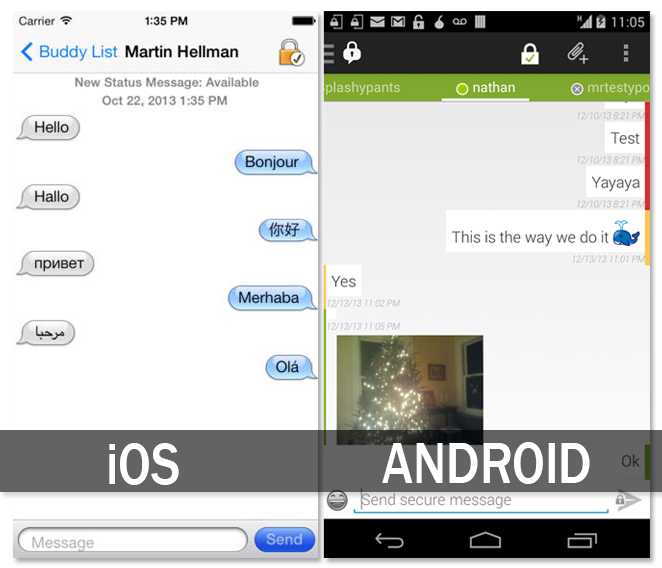

#A Facebook Chat Alternative

Facebook has removed the messaging capability of their primary app forcing users to install a separate Facebook Messenger application. The new app requires [extensive permissions](http://www.huffingtonpost.com/sam-fiorella/the-insidiousness-of-face_b_4365645.html) (though [Facebook](https://www.facebook.com/help/347452185405260) and [others](http://www.androidcentral.com/facebook-messenger-permissions-not-scary-stories-might-have-you-believe) claim the privacy implications are exaggerated). Regardless, being forced by a company to install a new app to get the same service their old one provided seems ridiculous and offers a great opportunity to look into alternatives.

##An Open Source, Encrypted Alternative

[ChatSecure](https://chatsecure.org/) is an open source, encrypted chat application for [iOS](https://itunes.apple.com/us/app/chatsecure/id464200063) and [Android](https://play.google.com/store/apps/details?id=info.guardianproject.otr.app.im&hl=en) from the privacy advocate group [The Guardian Project](https://guardianproject.info/). The app allows you to communicate across the open XMPP protocol - the same technology that Facebook utilizes (though slightly modified). This means that ChatSecure (and other XMPP/Jabber) clients can log into Facebook chat and be used for messaging. The client also works with other popular XMPP services like Google Talk/Hangouts, Dukgo, Jabber, etc.

The app sports off-the-record (OTR) messaging which is a popular and robust IM encryption standard. OTR means your messages can't be read by anyone but the recipient, that you know who you're chatting with, that you have deniability (in that there are no digital signatures), and gives you perfect forward secrecy (meaning your previous messages cannot be compromised). Additionally, the app itself sports optional local encryption to keep your messages safe should you lose your phone or have it taken from you. Without OTR, Facebook is free to read your messages and use the information for advertising or other purposes, your messages could be handed over to law enforcement or other government groups in plain text, and/or sensitive information could be captured from data breaches (hacks and bugs).

####Login Notes

Once you've installed the ChatSecure application, depending on your OS you'll see a Facebook button or an option to add a generic XMPP/Jabber server. You can find your Facebook chat login info [on Facebook's chat help](https://www.facebook.com/sitetour/chat.php) - just click "Other" under "Supported Clients."

###The Catch

Unfortunately, there are a number of catches that may discourage you from switching to ChatSecure. For one, the client is much less attractive than the polished Facebook Messenger app. This is more the case on Android than iOS, but the difference is notable and impacts the user experience.

 

OTR encryption only works if the person you're chatting with also is using ChatSecure or another OTR supported client ([Pidgin](https://securityinabox.org/pidgin_main), [Adium](https://adium.im/), etc). You can still chat in plain text (that is without encryption) with any user.

And the catch that is likely a dealbreaker for most: there is currently no push notification or fetch messages support. This means ChatSecure can only be used for live Facebook chats or sending a one-off message. To get a response, you have to be logged in with the app open. The good news is is that the dev team is currently [working on a fix](https://github.com/ChatSecure/ChatSecure-Push-Server/tree/master/docs/v3) though development seems to have slowed in recent months.

Security/Privacy is unfortunately often a clash between what is easy and convenient and what is the safe way to do something. Projects are underway to bridge that gap, but most are far from mature and ready for everyday use. This means that for the moment, we're limited by the quirks of software like ChatSecure or have to sign over our privacy to companies like Facebook (provided we keep using their services).

